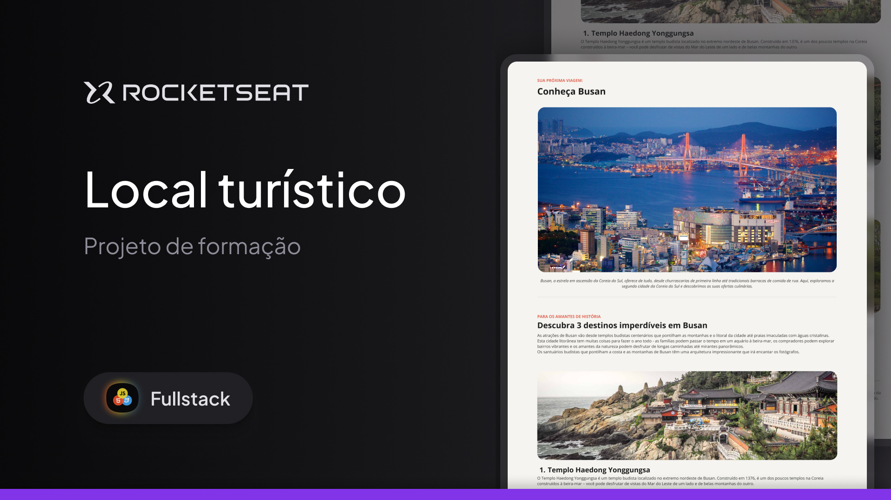

<h1 aling="center">Local turístico- Rocketseat - Full-Stack</h1>

Desafio realizado durante o curso Full-Stack da Rocketseat

  

## Tecnologias

Esse projeto foi desenvolvido com as seguintes tecnologias

- HTML
- CSS

## Projeto

Esse desafio é uma Landing Page de turismo utilizando apenas HTML e CSS. A página apresenta informações com destaque para locais turísticos, imagens atrativas e textos descritivos.
