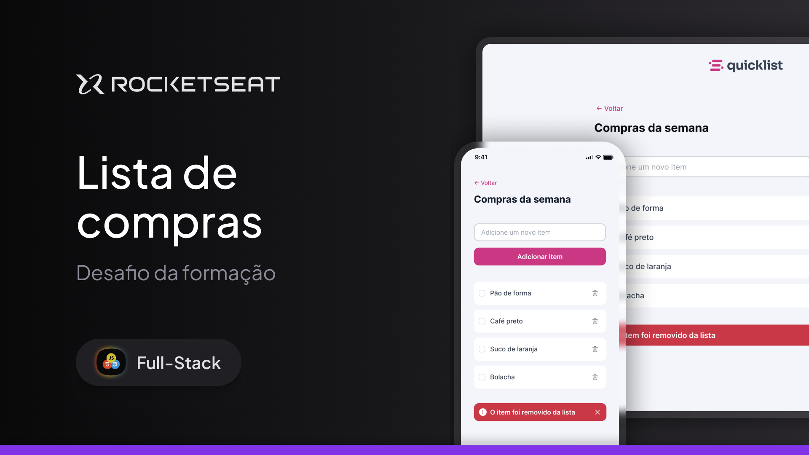

# Lista de compra - Full-Stack - Rocketseat

O projeto é um site responsivo de lista de compras onde o usuário pode gerenciar os itens adicionando e removendo eles.
Esse é um desafio prático da formação Full-Stack, um dos conteúdos disponíveis para alunos da Rocketseat.

## 🛠 Tecnologias

O projeto foi construído com:

- HTML
- CSS
- JavaScript

## ✨ Projeto

O foco desse projeto é colocar em prática os conceitos de JavaScript até aqui estudados. E o projeto tem as seguintes funções:

- Listar os itens.
- Adicionar novos itens;
- Remover item
- Marcar o item como concluído.

---

