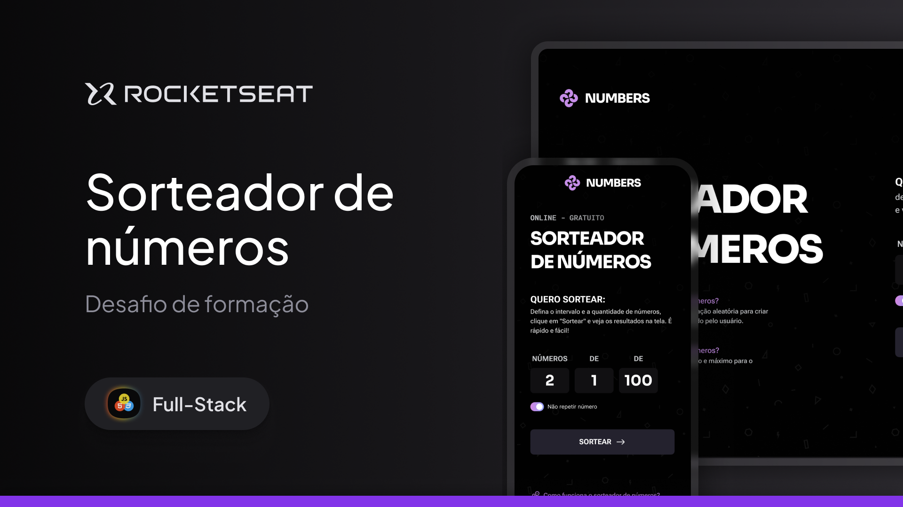

# Sorteador de números - Full-Stack - Rocketseat

Este projeto é uma aplicação web simples para sortear números aleatórios dentro de um intervalo definido pelo usuário.

## Ideia do projeto

A ideia é oferecer uma ferramenta rápida e fácil de usar para realizar sorteios de números, seja para jogos, desafios ou outras situações em que você precise gerar valores aleatórios.

## Funcionalidades

- Definir a quantidade de números que deseja sortear
- Escolher um intervalo mínimo e máximo
- Ativar a opção para não repetir números
- Exibir os resultados diretamente na tela

## Tecnologias utilizadas

- HTML
- CSS
- JavaScript

---

