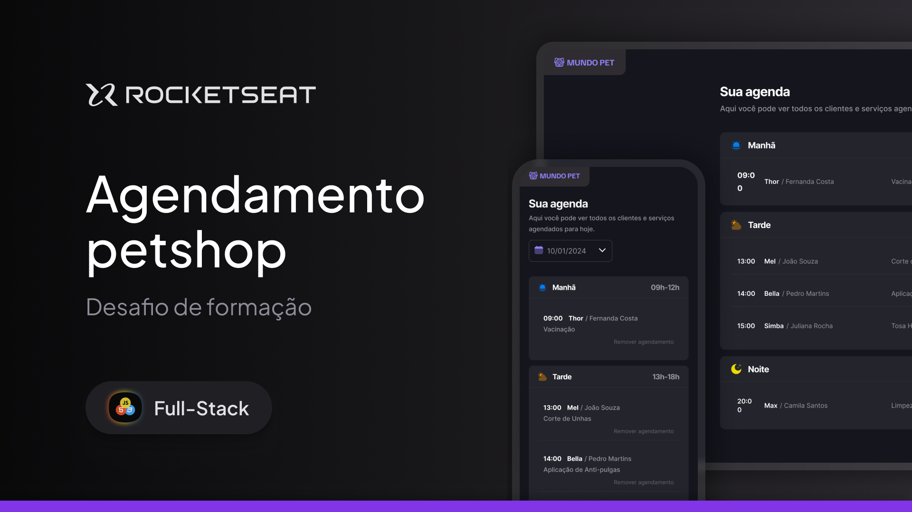

# Agendamento Petshop - Full-Stack - Rocketseat

Este projeto é uma aplicação web simples para gerenciar agendamentos de um petshop. Ele permite visualizar os atendimentos por período do dia, cadastrar novos agendamentos e cancelar reservas já existentes.

## O que o projeto faz

- Exibe uma agenda de atendimentos organizados por manhã, tarde e noite;
- Permite criar novos agendamentos por meio de um formulário modal;
- Possibilita cancelar agendamentos já registrados;
- Utiliza uma API local para armazenar os dados dos atendimentos.

## Tecnologias utilizadas

- HTML, CSS e JavaScript;
- Webpack;
- Json Server;
- Day.js.

---



## Como executar

1. Instale as dependências:

   ```bash
   npm install
   ```

2. Inicie o servidor da API local:

   ```bash
   npm run server
   ```

3. Inicie a aplicação:

   ```bash
   npm run dev
   ```

4. Acesse a aplicação no navegador através da porta indicada pelo Webpack.

## Observação

Este projeto foi desenvolvido como parte de um desafio da Rocketseat, com foco em prática de front-end e integração com uma API simples.
