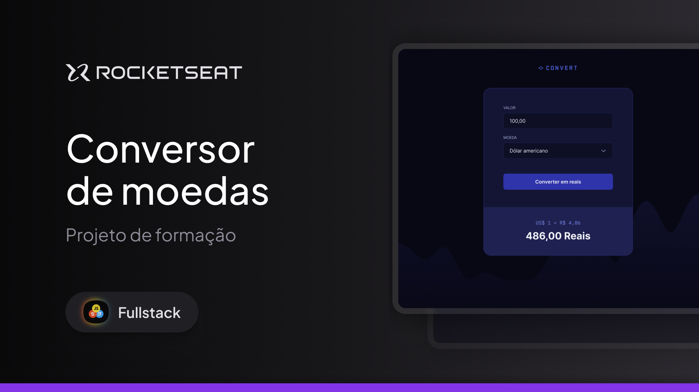

# Conversor de moedas Rocketseat - Full-Stack

Convert é uma aplicação web de conversão de moedas para real.
Esse é um dos projetos desenvolvidos em aula na formação de Full-stack.

## Tecnologias

Esse projeto foi desenvolvido com as seguintes tecnologias

- HTML
- CSS
- JavaScript

## Projeto

O foco desse projeto é aplicar os fundamentos do JavaScript, aprendidos nas aulas.

---

  

