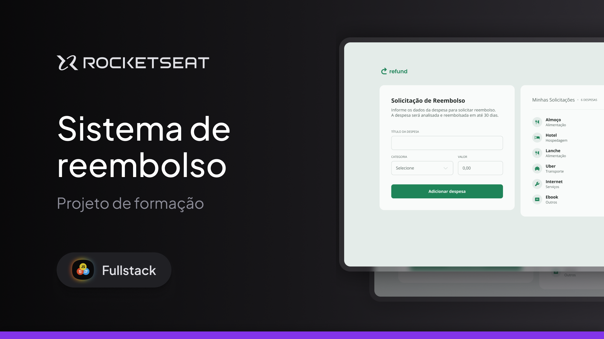

# Sistema de Reembolso - Refund - Full-Stack - Rocketseat

Este projeto é uma interface simples para registrar e acompanhar solicitações de reembolso de despesas.

## O que o projeto faz

O usuário pode preencher informações como:

- nome da despesa
- categoria
- valor da despesa

Ao enviar o formulário, a despesa é adicionada a uma lista lateral, onde é possível visualizar o total acumulado e a quantidade de itens cadastrados.

## Tecnologias utilizadas

- HTML
- CSS
- JavaScript

---

