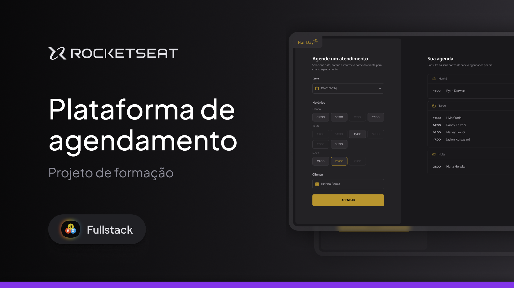

# Plataforma de Agendamento - Hair Day - Full-Stack - Rocketseat

Aplicação web para agendar atendimentos de cabelo, permitindo escolher uma data, um horário disponível e cadastrar o nome do cliente.

## O que faz

Este projeto simula um sistema de agendamento para uma barbearia ou salão de beleza. A interface permite:

- selecionar uma data;
- escolher um horário disponível;
- cadastrar um atendimento com o nome do cliente;
- visualizar os agendamentos por período do dia;
- cancelar agendamentos já criados.

## Tecnologias usadas

- HTML, CSS e JavaScript
- Webpack
- JSON Server
- Day.js

---



## Como executar

1. Instale as dependências:

   ```bash
   npm install
   ```

2. Inicie o servidor de dados:

   ```bash
   npm run server
   ```

3. Em outro terminal, inicie a aplicação:
   ```bash
   npm run dev
   ```

A aplicação estará disponível no navegador no endereço indicado pelo Webpack Dev Server.

## Observação

Esse projeto foi desenvolvido como parte de um exercício de desenvolvimento full stack com foco em front-end e integração com uma API local.
