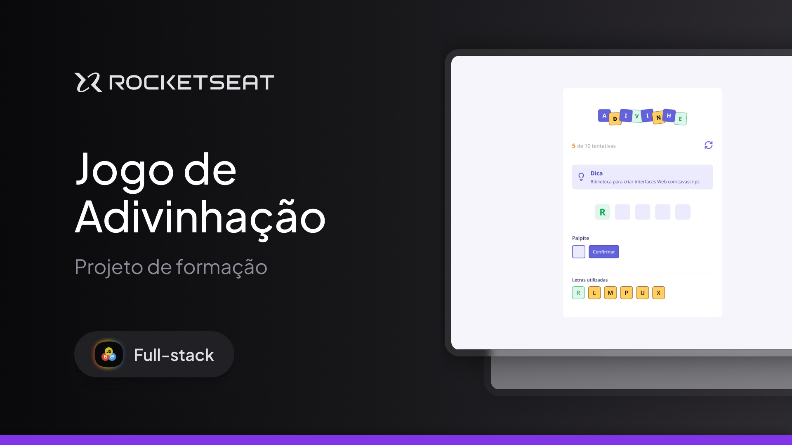

# Jogo de Adivinhação - Full-Stack - Rocketseat

Projeto desenvolvido durante o curso Full-Stack da Rocketseat A aplicação é um jogo de adivinhação no qual a pessoa jogadora deve descobrir palavras relacionadas ao desenvolvimento web a partir de uma dica e de seus palpites.

---



## Funcionalidades

- Sorteio de uma palavra ao iniciar ou reiniciar o jogo.
- Exibição de uma dica para cada palavra.
- Registro das letras já utilizadas.
- Indicação visual para letras corretas.
- Contagem de tentativas e limite de cinco tentativas extras além do tamanho da palavra.
- Mensagens para acertos, letras repetidas e fim de jogo.
- Reinício manual da partida.

## Tecnologias

- React
- TypeScript
- Vite
- CSS Modules

## Como executar

### Pré-requisitos

- Node.js instalado.
- npm instalado.

### Instalação

1. Instale as dependências:

   ```bash
   npm install
   ```

2. Inicie o servidor de desenvolvimento:

   ```bash
   npm run dev
   ```

3. Acesse a URL exibida no terminal, normalmente `http://localhost:5173`.

## Scripts disponíveis

- `npm run dev`: inicia o servidor de desenvolvimento.
- `npm run build`: executa a verificação do TypeScript e gera a versão de produção.
- `npm run preview`: serve localmente a versão de produção gerada.

## Contexto

Este projeto faz parte da formação Full-Stack da Rocketseat e foi criado para praticar a construção de interfaces com React, gerenciamento de estado, componentização e estilização com CSS Modules.
