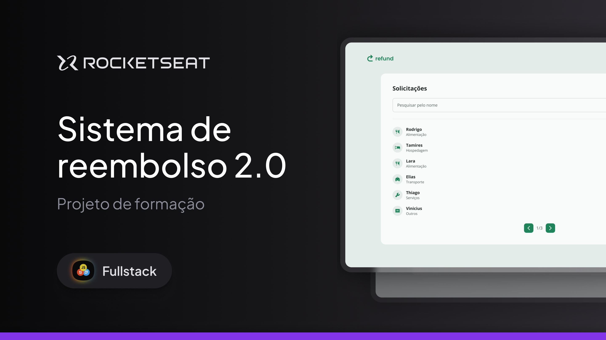

# Refund 2.0 - Full-Stack - Rocketseat

Aplicacao web para solicitacao e gerenciamento de reembolsos, desenvolvida durante o curso Full-Stack da Rocketseat. O projeto apresenta fluxos diferentes para colaboradores e gestores, com uma interface responsiva para cadastrar despesas, consultar solicitacoes e visualizar seus detalhes.

---



## Funcionalidades

- Tela de login e cadastro de usuario
- Criacao de uma solicitacao de reembolso
- Selecao de categoria e valor da despesa
- Upload do comprovante
- Dashboard de solicitacoes para gestores
- Busca de solicitacoes pelo nome
- Paginacao da lista de solicitacoes
- Visualizacao dos detalhes de uma solicitacao
- Layout responsivo para diferentes tamanhos de tela

## Tecnologias

- React
- TypeScript
- Vite
- React Router
- Tailwind CSS
- clsx
- tailwind-merge

## Como executar

### Pre-requisitos

- Node.js 20.19 ou superior
- npm

### Instalacao

1. Instale as dependencias:

   ```bash
   npm install
   ```

2. Inicie o servidor de desenvolvimento:

   ```bash
   npm run dev
   ```

3. Acesse a URL exibida no terminal, normalmente `http://localhost:5173`.

## Scripts disponiveis

| Comando           | Descricao                                                |
| ----------------- | -------------------------------------------------------- |
| `npm run dev`     | Inicia o servidor de desenvolvimento                     |
| `npm run build`   | Gera a versao de producao e verifica os tipos TypeScript |
| `npm run preview` | Executa uma previa da build de producao                  |

## Status do projeto

Este repositorio contem a camada web desenvolvida no curso. No estado atual, os dados exibidos sao demonstrativos e algumas açoes utilizam estado local e `alert`.

## Aprendizados

O projeto foi construido para praticar composicao de componentes React, tipagem com TypeScript, roteamento, formularios, upload de arquivos, controle de estado e estilizacao responsiva com Tailwind CSS.
