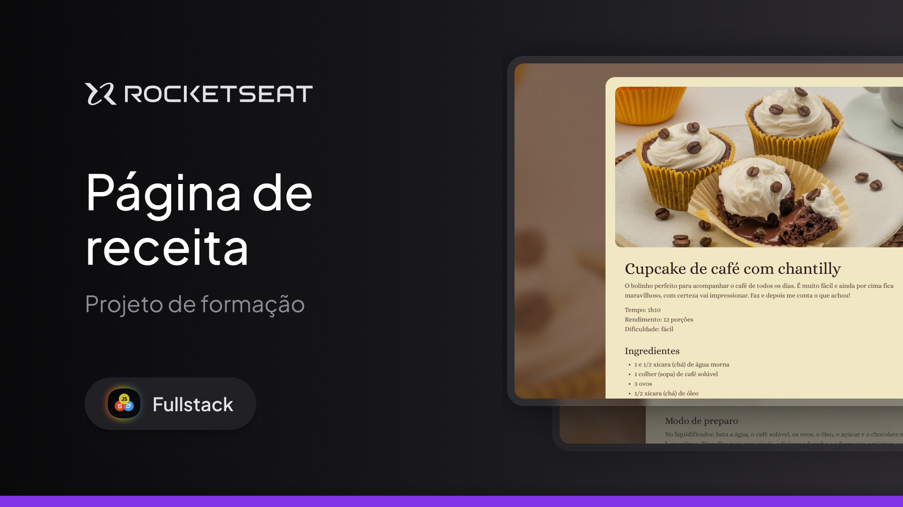
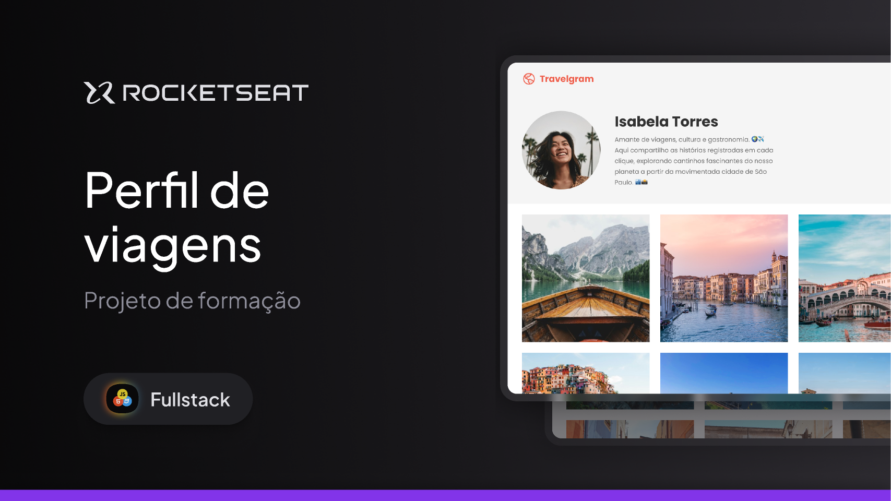
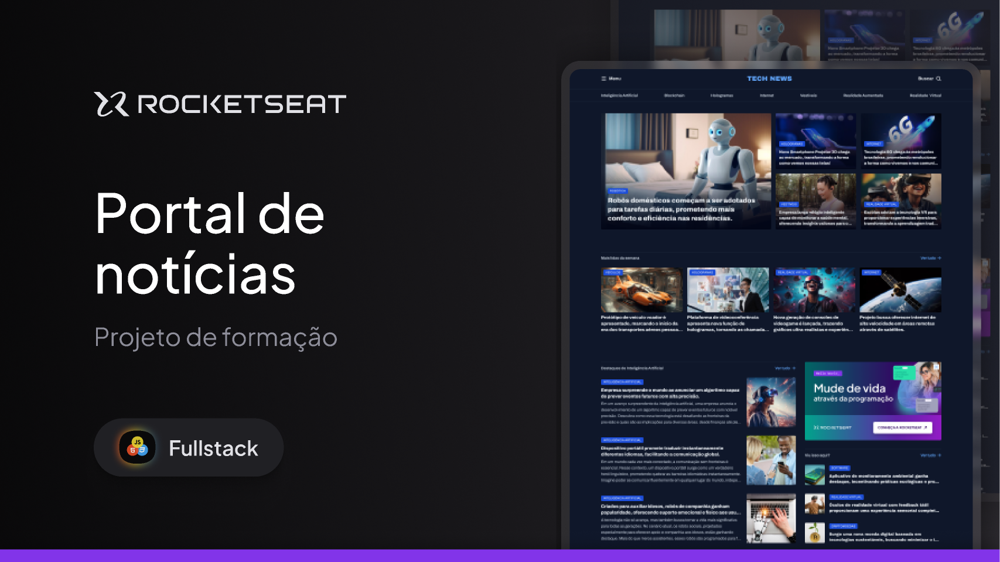
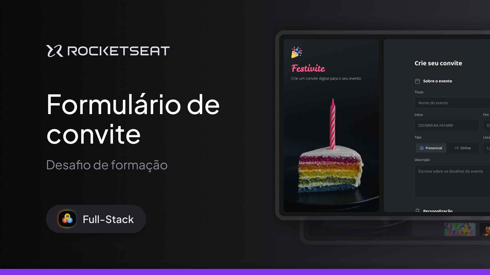

# Full-Stack Rocketseat

Minha resolução dos projetos e desafios do Full-Stack da Rocketseat
 
<a href="https://www.rocketseat.com.br" target="_blank">Conheça a Rocketseat</a>

<table align="center">
  <thead>
    <tr>
      <th align="center">
        
Nome

      </th>
      <th align="center">
        
Preview

      </th>
    </tr>
  </thead>
  <tbody>
    <tr>
      <td><a href="Projeto01_pagina_de_receita">Projeto 1 - Página de receita</a></td>
      <td align="center"></td>
    </tr>
    <tr>
      <td><a href="Desafio01_local_turistico">Desafio 01 - Local turístico</a></td>
      <td align="center"></td>
    </tr>
    <tr>
      <td><a href="Projeto02_perfil_de_viagens">Projeto 2 - Perfil de viagens - Travelgram</a></td>
      <td align="center"></td>
    </tr>
    <tr>
      <td><a href="Projeto03_portal_de_noticias">Projeto 3 - Portal de notícias</a></td>
      <td align="center"></td>
    </tr>
    <tr>
      <td><a href="Desafio02_portfolio_dev">Desafio 02 - Portfólio Dev</a></td>
      <td align="center"></td>
    </tr>
    <tr>
      <td><a href="Projeto04_formulario_de_matricula">Projeto 4 - Formulário de matrícula</a></td>
      <td align="center"></td>
    </tr>
    <tr>
      <td><a href="Desafio03_formulario_de_convite">Desafio 03 - Formulário de convite</a></td>
      <td align="center"></td>
    </tr>
    <tr>
      <td><a href="Projeto05_LP_de_produto_zingen">Projeto 5 - Landing Page - Zingen</a></td>
      <td align="center"></td>
    </tr>
    <tr>
      <td><a href="Projeto06_LP_animada">Projeto 6 - Landing Page Animada - Snitap</a></td>
      <td align="center"></td>
    </tr>
    <tr>
      <td><a href="Desafio04_LP_clube_de_assinatura">Desafio 04 - LP de Clube de Assinatura</a></td>
      <td align="center"></td>
    </tr>
    <tr>
      <td><a href="Projeto07_convert_template">Projeto 7 - Conversor de moeda</a></td>
      <td align="center"></td>
    </tr>
    <tr>
      <td><a href="Desafio05_Lista_de_compra">Desafio 05 - Lista de compra</a></td>
      <td align="center"></td>
    </tr>
    <tr>
      <td><a href="Projeto08_refund">Projeto 8 - Refund</a></td>
      <td align="center"></td>
    </tr>
    <tr>
      <td><a href="Desafio06_sorteador_de_numeros">Desafio 06 - Sorteadir de números</a></td>
      <td align="center"></td>
    </tr>
    <tr>
      <td><a href="Projeto09_hairday">Projeto 9 - Hairday</a></td>
      <td align="center"></td>
    </tr>
    <tr>
      <td><a href="Desafio07_agendamento_petshop">Desafio 07 - Agendamento petshop</a></td>
      <td align="center"></td>
    </tr>
    <tr>
      <td><a href="Projeto10_API_de_ticket_de_suporte">Projeto 10 - API de Ticket de Suporte</a></td>
      <td align="center" width="250px">API REST simples para gerenciar tickets de suporte (criação, listagem, atualização, fechamento e remoção).</td>
    </tr>
  </tbody>
</table>
